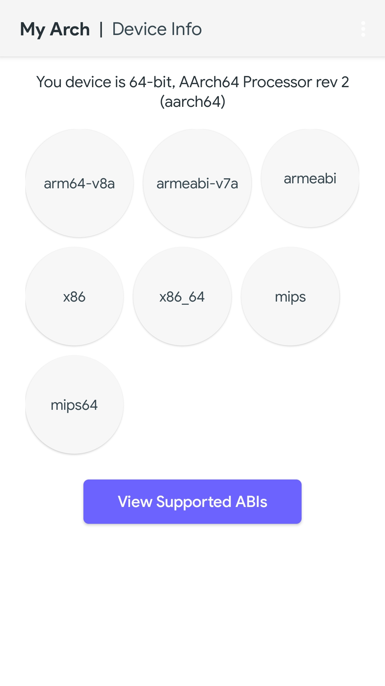
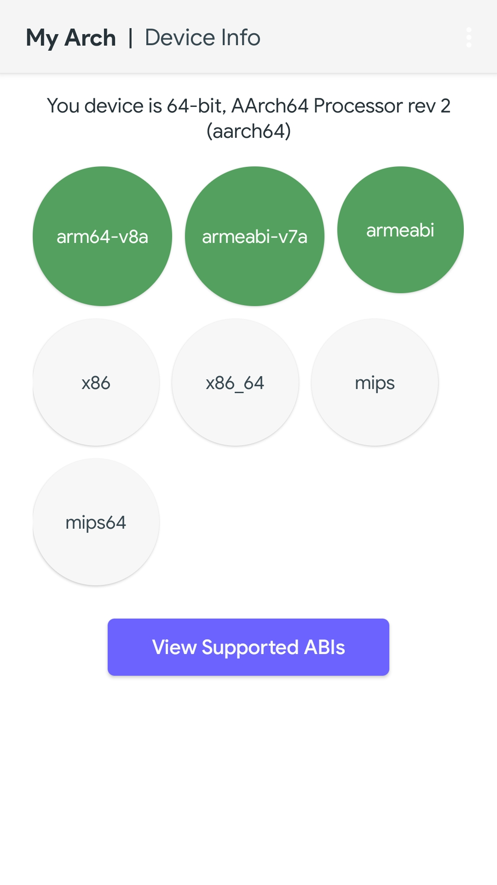
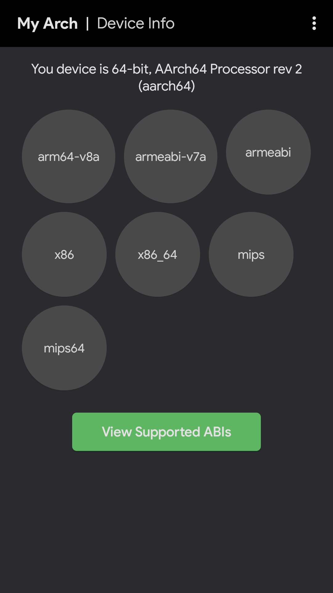
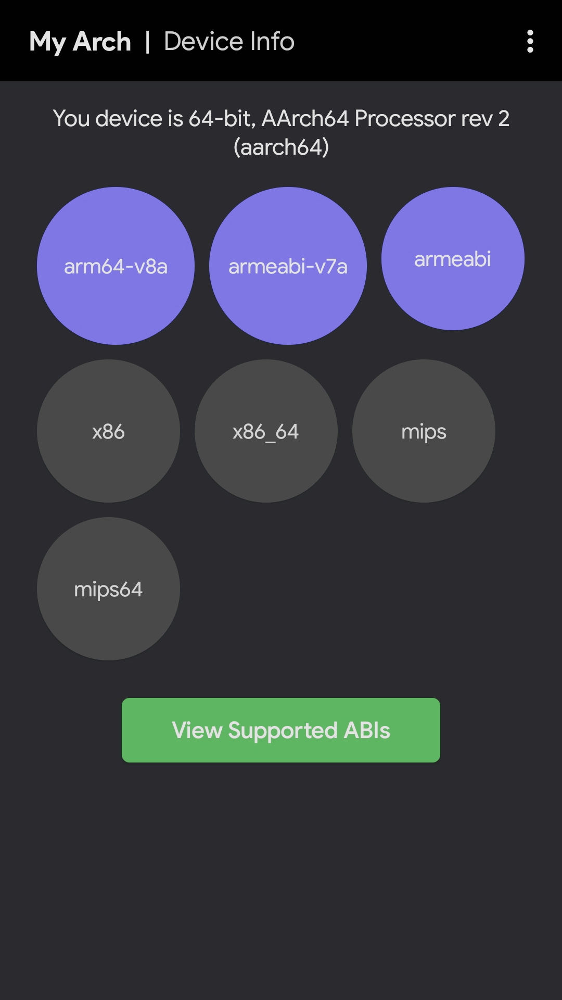

[![Contributors][contributors-shield]][contributors-url]
[![Forks][forks-shield]][forks-url]
[![Stargazers][stars-shield]][stars-url]
[![Issues][issues-shield]][issues-url]
[![MIT License][license-shield]][license-url]

    

<h1 align="center">
  <b>MyArch</b>
</h1>
 

    
An android application which can show all suported ABIs of the running device

<h1 align="left">
  <b>What is ABI?</b>
</h1>

    Different Android devices use different CPUs, which in turn support different instruction sets. Each combination of CPU and instruction set has its own Application Binary Interface (ABI). An ABI includes the following information: The CPU instruction set (and extensions) that can be used.

<h1 align="left">
    Built wtih
</h1>

* 
    

<h1 align="left">
  <b>Screenshots</b>
</h1>

<h1 align="left">
  <b>&nbsp;Credits</b>
</h1>
 - Icons by <a target="_blank" href="https://icons8.com/icon/">Icons8</a>

<h1 align="left">
  <b>&nbsp;License</b>
</h1>

  
MyArch is licensed under [GNU General Public License](https://www.gnu.org/licenses/gpl-3.0.html) v3 or later.

---

[contributors-shield]: https://img.shields.io/github/contributors/codehasan/MyArch.svg?style=for-the-badge
[contributors-url]: https://github.com/codehasan/MyArch/graphs/contributors
[forks-shield]: https://img.shields.io/github/forks/codehasan/MyArch.svg?style=for-the-badge
[forks-url]: https://github.com/codehasan/MyArch/network/members
[stars-shield]: https://img.shields.io/github/stars/codehasan/MyArch.svg?style=for-the-badge
[stars-url]: https://github.com/codehasan/MyArch/stargazers
[issues-shield]: https://img.shields.io/github/issues/codehasan/MyArch.svg?style=for-the-badge
[issues-url]: https://github.com/codehasan/MyArch/issues
[license-shield]: https://img.shields.io/github/license/codehasan/MyArch.svg?style=for-the-badge
[license-url]: https://github.com/codehasan/MyArch/blob/master/LICENSE.txt
